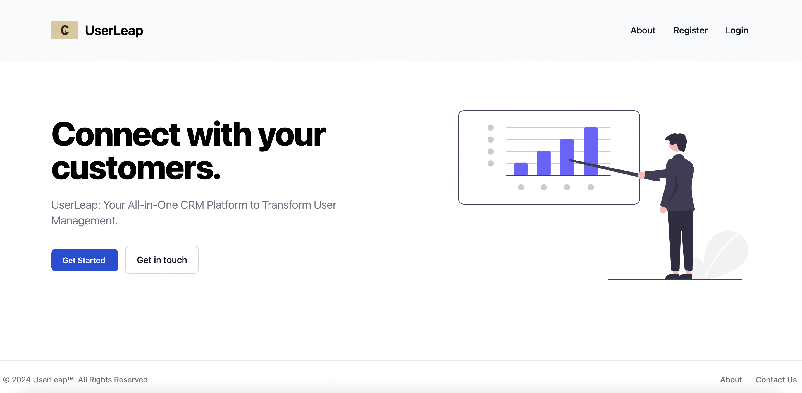

# User Leap

UserLeap is a Django based Customer Relationship Management web app designed to streamline user management and organize user data.

## User Management:

- **Seamless User Onboarding**: Streamline the process with user login, signup, and registration functionalities.
- **Centralized Customer Database**: Manage all your customer interactions effectively with a detailed customer table.
- **Effortless Customer Management**: Add, edit, and organize customer details easily.

## Enhanced User Experience:

- **Personalized Accounts**: Empower users to manage their account information with an intuitive self-edit feature.
- **Streamlined Support**: Provide a dedicated contact us form for users to conveniently report any issues or seek assistance directly from administrators, ensuring prompt resolution and a positive user experience.

## UserLeap enables you to:

- **Build Stronger Relationships**
- **Boost Efficiency**
- **Make Informed Decisions**
